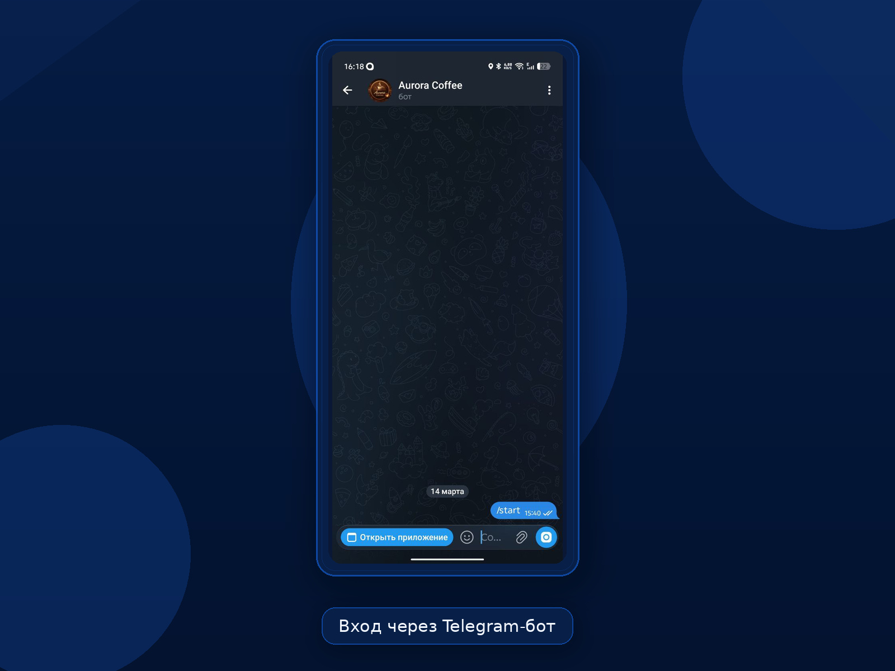
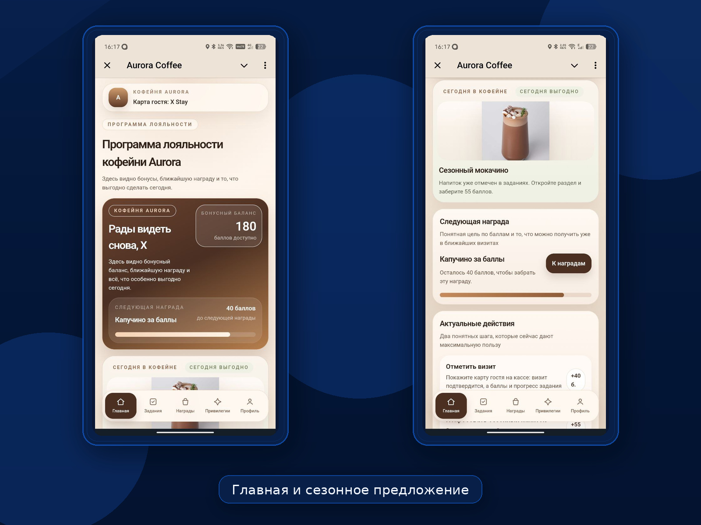
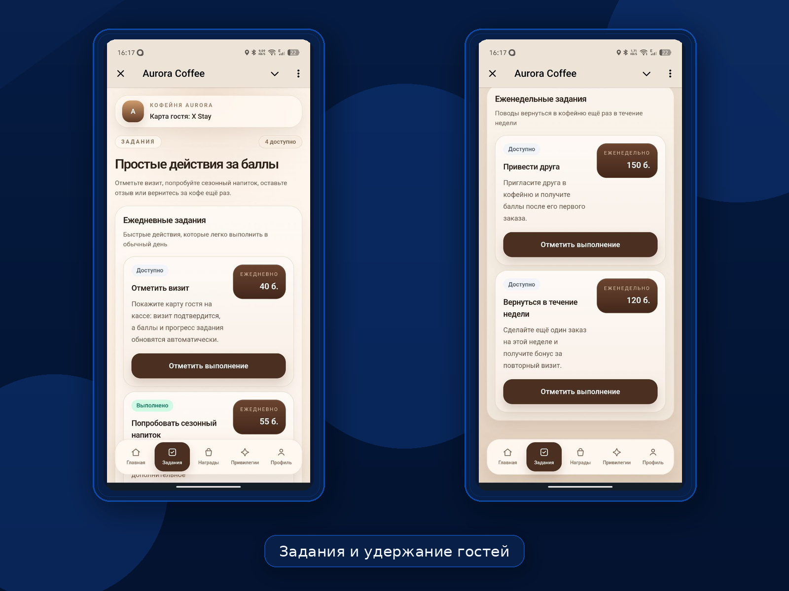
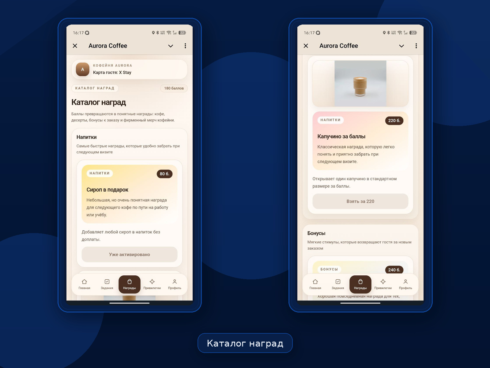
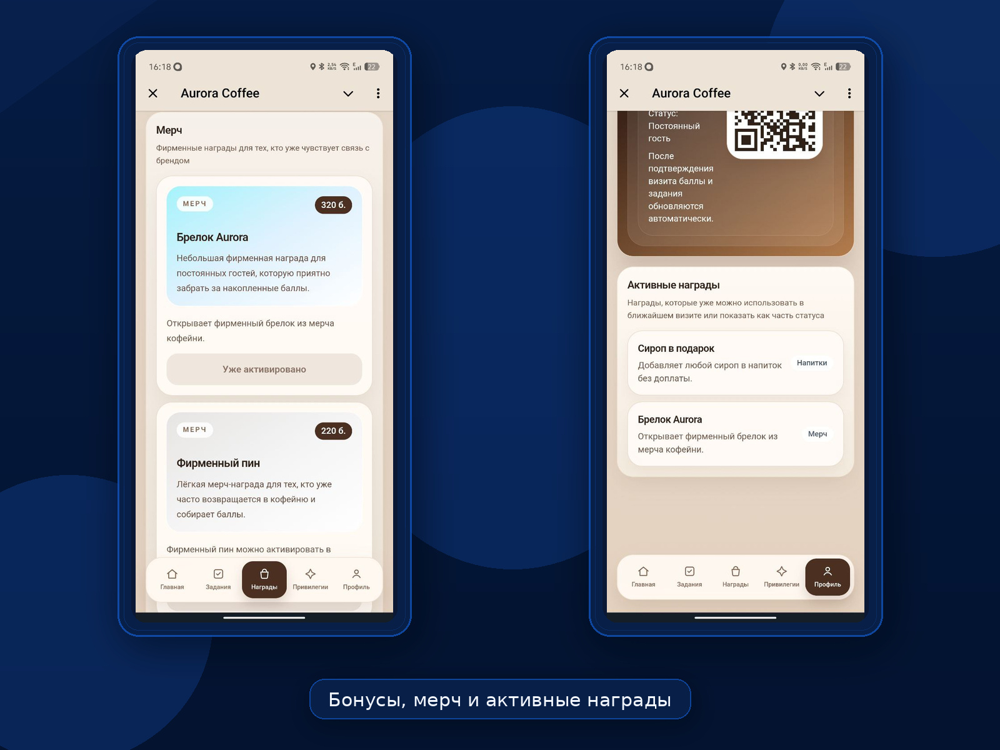
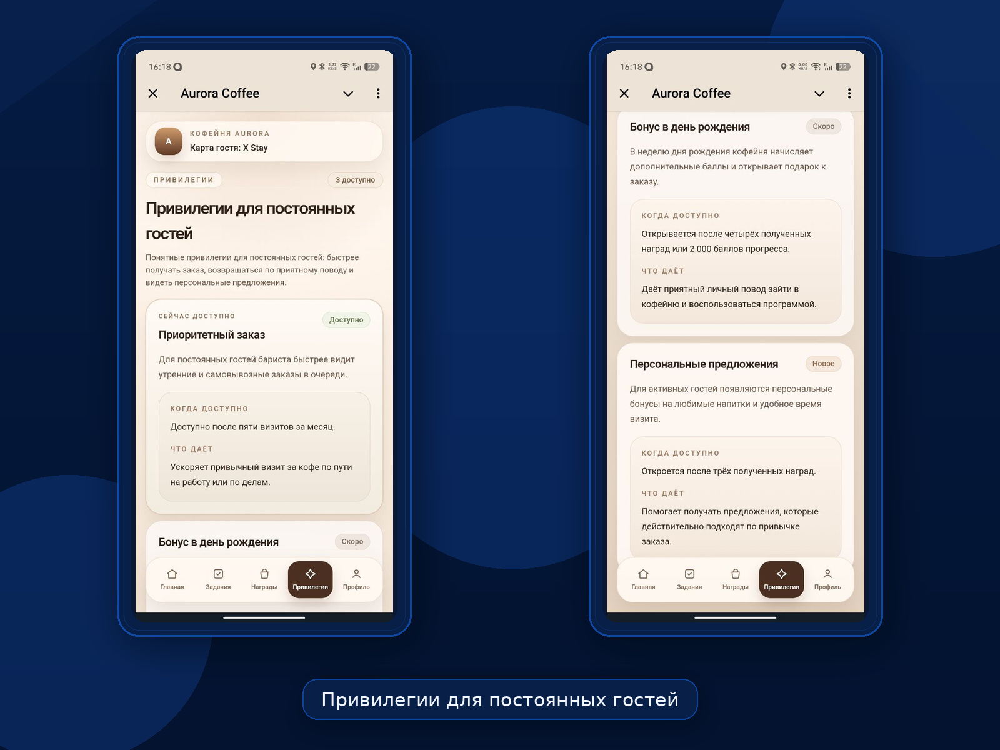
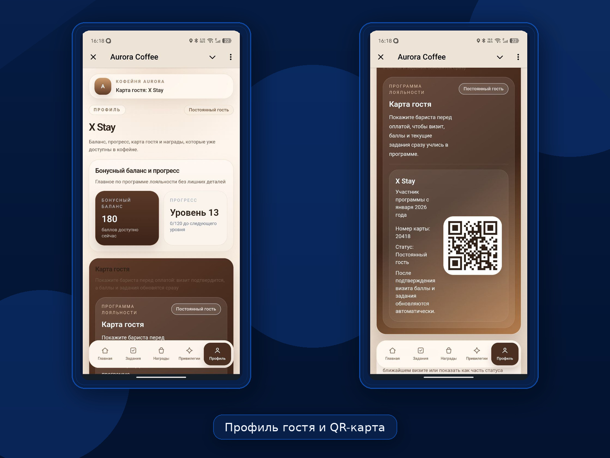
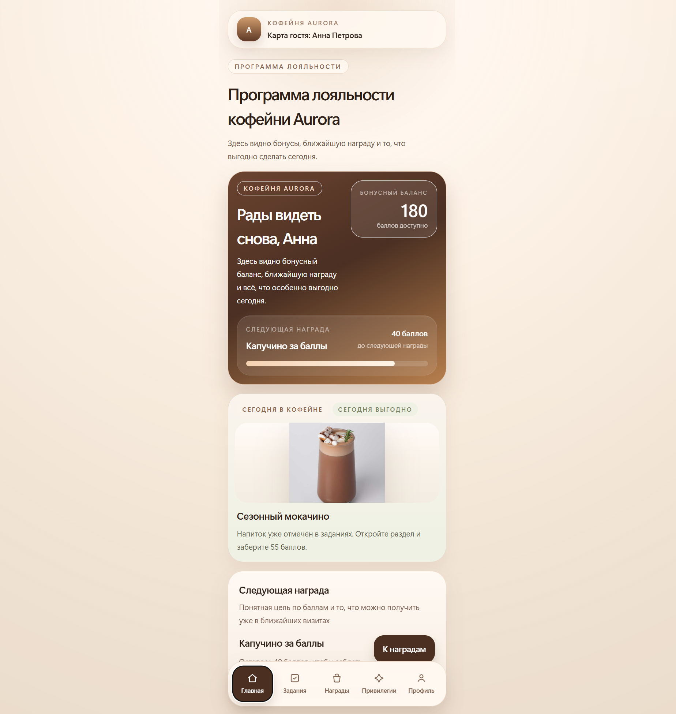
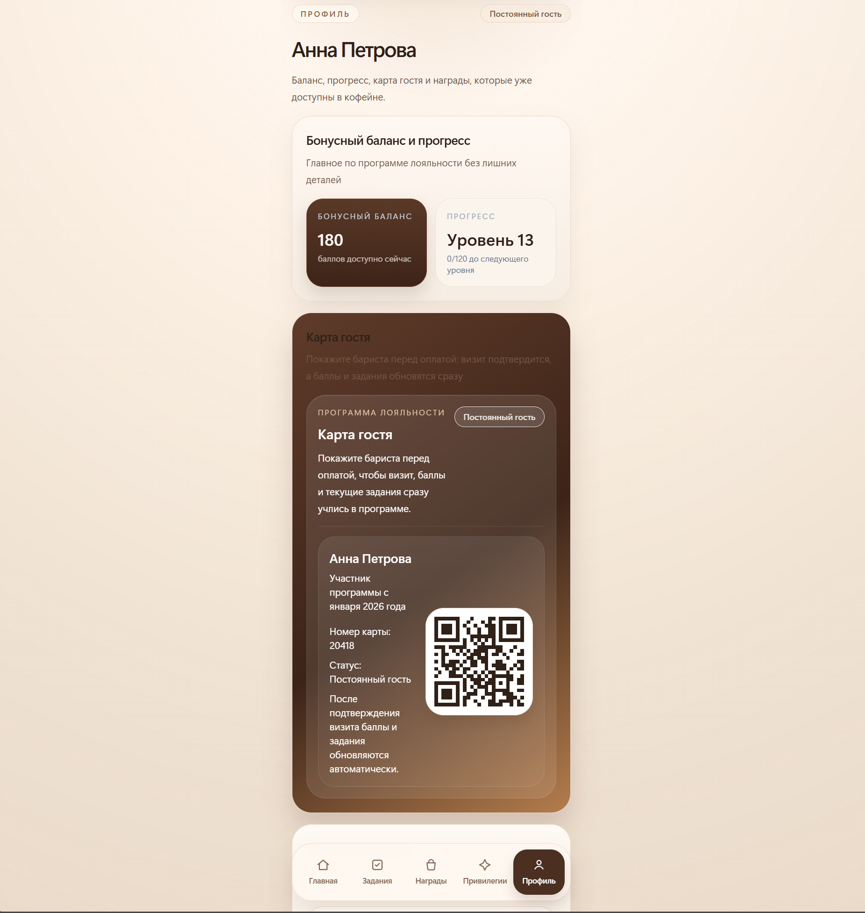

# Aurora Bonus

Aurora Bonus — Telegram Mini App для программы лояльности кофейни Aurora Coffee. Интерфейс собран в mobile-first формате и показывает полный пользовательский сценарий внутри Telegram: бонусный баланс, задания на повторные визиты, каталог наград, персональные привилегии и QR-карту гостя.

**Формат проекта:** Telegram Mini App для кофейни  
**Стек:** Vite, React, TypeScript, Tailwind CSS, Zustand, Telegram WebApp  
**Формат запуска:** внутри Telegram и в браузере для локальной проверки и desktop-просмотра

## Обзор продукта

Aurora Bonus показывает, как может выглядеть современная программа лояльности для кофейни или небольшой сети без отдельного мобильного приложения. Пользователь видит актуальный бонусный баланс, путь к следующей награде, действия на сегодня, персональные привилегии и карту гостя для подтверждения визита.

Сценарий остаётся простым и понятным: гость открывает Mini App в Telegram, возвращается за сезонными предложениями, выполняет действия для роста активности, обменивает баллы на награды и показывает QR-карту при визите в кофейню.

## Какие задачи решает продукт

- помогает удерживать гостей без отдельного приложения
- стимулирует повторные визиты через понятные действия и награды
- делает бонусную механику заметной и удобной внутри Telegram
- упрощает подтверждение визита через карту гостя и QR-код
- объединяет награды, сезонные предложения и привилегии в одном интерфейсе

## Ключевые возможности

- главный экран с бонусным балансом, прогрессом и ближайшей наградой
- задания для повторных визитов и вовлечения в программу лояльности
- каталог наград с напитками, бонусами к заказу и фирменным мерчем
- экран привилегий для активных гостей
- профиль участника с QR-картой гостя
- поддержка Telegram WebApp с browser fallback
- хранение состояния через Zustand и `localStorage`

## Демонстрация интерфейса

### Вход через Telegram-бот



### Главная



### Задания



### Награды



### Бонусы и мерч



### Привилегии



### Профиль и карта гостя



## Браузерная версия

Интерфейс также открывается в обычном браузере. Это удобно для локальной проверки, демонстрации desktop-вёрстки и просмотра экранов без Telegram-контекста.

> Ниже можно развернуть desktop-скриншоты.

<details>
  <summary><strong>Показать desktop-скриншоты</strong></summary>

  <br />

  <p>
    <strong>Главная страница в браузере</strong>
  </p>
  

  <p>
    <strong>Профиль и QR-карта в браузере</strong>
  </p>
  
</details>

## Где такой формат подходит

- для независимой кофейни с программой лояльности в Telegram
- для небольшой сети кофеен с единым сценарием наград и бонусов
- для coffee to go формата, где важны скорость, повторные визиты и простая карта гостя
- для брендов, которым нужен понятный loyalty-интерфейс без отдельного мобильного приложения

## Технологии

- **Frontend:** React 19, TypeScript, Vite
- **UI:** Tailwind CSS
- **Состояние:** Zustand с persistence в `localStorage`
- **Интеграция:** Telegram WebApp runtime + browser fallback
- **Tooling:** ESLint, PostCSS

## Локальный запуск

```bash
npm install
npm run dev
```

Сборка production-версии:

```bash
npm run build
```

## Telegram WebApp

Проект рассчитан на запуск как внутри Telegram, так и в обычном браузере. Если приложение открыто из Telegram-бота, интерфейс получает пользовательские данные, viewport и safe area из Telegram WebApp runtime. Если Telegram-контекста нет, используется стабильный browser fallback для локальной проверки и desktop-просмотра.
